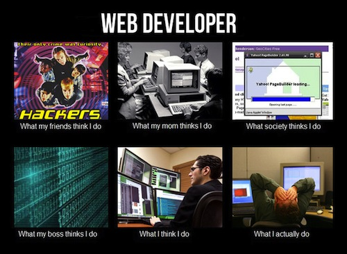
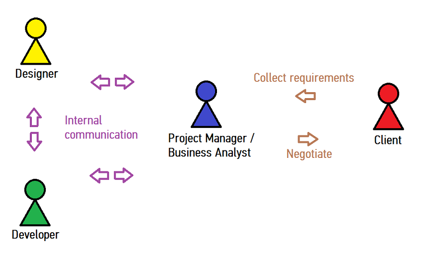

# FEWD LESSON 1

## FEWD - HTML BASICS

### Instructors
Kit Yuen & Mart van de Ven 


## Agenda

* Round of Introductions
* Course Information
* What is Web Development?
* How a web project works?
* Codepen.io
* Text Editor
* Version Control
* Lab: Cookie Recipe
* HTML Basics
* Homework


## Who we are
<aside class="notes">Kit ~ 3 Min</aside>

Kit Yuen

* Founder of QPon
* Freelancer
* Best practice engineer
* Traveler


## Who we are
<aside class="notes">Mart ~ 3 Min</aside>

Mart van de Ven

* BA Political Science, MSc Knowledge Management, MPhil Linguistics
* Founder, Open Data Hong Kong (2013 - current)
* Instructor, General Assembly (2013 - current)
* Developer, DemandAnalytics (2012) / DemystData (2013)
* Coding as Prism
* G.U.I.D.E.
* Open Source & Open Data


## Course Information
<aside class="notes">Mart ~ 3 Min</aside>

* Class Structure
* Final Project
  * [Example](http://studio.generalassemb.ly/HK/FEWD1/Sean/1_Projects/0_final_v3/)
* Grading Policy


## ... and who do we have here?
<aside class="notes">Class ~ 4 Min</aside>

* Tell us a bit about yourselves
* What are you hoping to achieve
* Already have any plans for your project?
* Fill out the [GA Student Profile](https://generalassembly.wufoo.com/forms/z1h8zknc05ro769/)!


## What is Web Development?
<aside class="notes">Kit ~ 3 Min</aside>

### Client-Side

* HTML
* CSS
* JavaScript


## What is Web Development?
<aside class="notes"></aside>

### Server-Side

* Ruby
* PHP
* Python
* PERL
* C++


## What is Web Development?
<aside class="notes">Kit ~ 15 Min</aside>




## What is Web Development?
<aside class="notes"></aside>

Website

* Single page of plain text
* http://www.columbia.edu/~fdc/sample.html
* Text-based browser - lynx
* Rich user interface browsers - chrome, firefox


## What is Web Development?
<aside class="notes"></aside>

Web applications

* Online shop
* http://www.amazon.com 
* Social networks
* http://www.facebook.com


## What is Web Development?
<aside class="notes"></aside>

For a static website, web development can simply refer to:

* Writing markup: HTML
* Writing style: CSS
* Coding: Javascript


## How a web project works?
<aside class="notes"></aside>


<aside class="notes"></aside>



## How a web project works?
<aside class="notes"></aside>

For large web applications, it could involve hundreds of people working on different aspects including:

* Web design: Graphical designer
* GUI design (Graphical User Interface): UX designer
* Front End Web Development (Client side): Javascript developer, Flash developer
* Back End Web Development (Server side): PHP, Ruby, Python developer
* Database: Database engineer, Database administrator
* Code optimization: SEO engineer
* Testing: Test developer, QA
* Application deployment: Best practice engineer
* Web server setup & Security: Server administrator, Best practice engineer


## How a web project works?
<aside class="notes">Mart ~ 5 Min</aside>

Developer Tools

* Text Editor / Integrated Development Environment
* Automated Test Suits
* Deployment Tools

<br>
Project Management Tools

* Project management tool
* Bug tracker
* Version control


## Get yourself armed
<aside class="notes"></aside>


## Codepen.io
<aside class="notes">Kit ~ 3 Min</aside>

### Write you code online @ [codepen.io](http://codepen.io/)


## Text Editor
<aside class="notes">Mart ~ 20 Min</aside>
[SublimeText3](http://www.sublimetext.com/3)

* [Package Control](https://sublime.wbond.net/installation#st3)
* Create a project
* introduce yourself to `p`.
* Try to make a good first impression.
* You will love `p`.
* [Hacks](http://hexlator.blogspot.hk/2013/05/best-sublime-text-2-tips-tricks-hacks.html), [Tips](http://net.tutsplus.com/articles/news/perfect-workflow-in-sublime-text-free-course/) & [Tricks](http://net.tutsplus.com/tutorials/tools-and-tips/sublime-text-2-tips-and-tricks/)


## Version Control
<aside class="notes">Mart ~ 60 Min</aside>

### Installation

* Linux: [Git](https://help.github.com/articles/set-up-git)
* Mac: [Homebrew](http://brew.sh/), [XCode](https://developer.apple.com/xcode/)
* Windows: [GitHub on Windows](http://windows.github.com/)
* Verify the git installation in Terminal/PowerShell
  * `git --version`


## Git Concepts
<aside class="notes">
  Mart ~ 10 Min
  Provide a high-level overview of the work-flow in Git by talking about how the following items make distirbuted collaboration possible
</aside>

### The Hash
### The Branch
### The Diff
### The Merge


## Version Control
<aside class="notes">
  Help the students to fork the repository and setup the gh-pages branch
</aside>

* Sign-up with [GitHub](https://github.com/signup/free)
* `fork` the [FEWD repository](https://github.com/ga-students/FEWD_HK_4)
* Open Terminal/PowerShell and checkout the source code by
  * `git clone https://github.com/ga-students/FEWD_HK_4.git`
* [Pave the way](https://help.github.com/articles/making-changes) for your final project
* Serve your website with [GitHub Pages](https://help.github.com/articles/creating-project-pages-manually)
* [Marvel](https://github.com/) at your mastery over Git
* ... the most complicated tool built by mankind


## Course Flow
<aside class="notes">Mart ~ 3 Min</aside>

* Visit [http://ga-students.github.io/FEWD_HK_4/](http://ga-students.github.io/FEWD_HK_4/) for the slides
* Or check the slides markdown file in your local FEWD repository.  
* Ask questions via E-mail or [Github Issues](https://github.com/ga-students/FEWD_HK_4/issues).
* Setup Google+ to receive e-mail notifications if you haven't already


## HTML Tags
<aside class="notes">Mart ~ 30 Min</aside>


## General Assembly Press Release

* Introduce the basic structure of a HTML
* Demonstrate some cool features provided by Sublime Text
* [Useful Sublime Text 2 Hotkeys for Mac](http://docs.sublimetext.info/en/latest/reference/keyboard_shortcuts_osx.html)
* [Useful Sublime Text 2 Hotkeys for Win](http://docs.sublimetext.info/en/sublime-text-2/reference/keyboard_shortcuts_win.html)


## HTML Basics
<aside class="notes">Kit ~ 20 Min</aside>


## HTML vs HTML5
<aside class="notes"></aside>

HTML5 is HTML with a few additions
The Doctype tells you if the page is HTML5 ready.

```<!DOCTYPE html>```


## HTML HISTORY
<aside class="notes"></aside>


## HTML Syntax
<aside class="notes"></aside>


## Content Tags
<aside class="notes"></aside>

### Heading Elements

```<h1>```Largest Heading```</h1>```

```<h2>``` . . . ```</h2>```

```<h3>``` . . . ```</h3>```

```<h4>``` . . .```</h4>```

```<h5>``` . . . ```</h5>```

```<h6>```Smallest Heading```</h6>```


## Content Tags
<aside class="notes"></aside>

### Text Elements

```<p>```This is a paragraph```</p>```

```<code>```This is some computer code```</code>```


## Content Tags
<aside class="notes"></aside>

### Unordered list
```<ul>``` ```</ul>```


## Content Tags
<aside class="notes"></aside>

### Unordered list item

```<li>```First item```</li>```<br>
```<li>```Next item```</li>```<br>


## Content Tags
<aside class="notes"></aside>

### Unorder list example

`<ul>`<br>
&nbsp;&nbsp;`<li>`First item`</li>`<br>
&nbsp;&nbsp;`<li>`Second item`</li>`<br>
&nbsp;&nbsp;`<li>`Third item`</li>`<br>
`</ul>`


## HTML Syntax
<aside class="notes"></aside>


## Content Tags
<aside class="notes"></aside>

### links
```<a href="Link">```First item```</a>```


## Cookie Recipe
<aside class="notes">Both ~ 30 Min</aside>


* Create your first index.html
* Try the __html__ + __Tab__ magic
* [HTML Quick List](http://www.w3schools.com/html/html_quick.asp)


## Homework
<aside class="notes">Both ~ 5 Min</aside>

* Create a resume website like Wendy G. Bite
  * [About me](https://raw.github.com/ga-students/FEWD_HK_4/gh-pages/lesson2/labs/wendy_resume/WendyBite_AboutMe.png)
  * [Résumé](https://raw.github.com/ga-students/FEWD_HK_4/gh-pages/lesson2/labs/wendy_resume/WendyBite_Resume.png)
* [Don't Fear The Internet](http://www.dontfeartheinternet.com/the-basics/not-tubes)


## Readings
<aside class="notes"></aside>

* [General Assembly's Programming For Non Programmers](https://generalassemb.ly/online/videos/programming-for-non-programmers-get-started-with-html)
* [The Guardian Blog](http://www.theguardian.com/help/insideguardian/2009/sep/28/blogpost)
* [Web Design or Web Development, What’s The Difference?](http://purelybranded.com/insights/web-design-or-web-development-whats-the-difference/)
* [Redefining Web Designers, Web Developers, and Web Hybrids for the modern market](http://tristandenyer.com/redefining-web-designers-web-developers-and-web-hybrids-for-the-modern-market/)
* [How The Internet Works in Five Minutes](http://www.youtube.com/embed/7_LPdttKXPc)
* [How does the Internet work? - Naked Science Scrapbook](http://www.youtube.com/watch?v=oj7A2YDgIWE)
* [How The Internet Works - cartoon](http://landofthefreeish.com/pics/how-the-internet-works/)