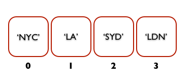

# FEWD LESSON 10

## FEWD - Arrays

### Instructors
Kit Yuen & Mart van de Ven


## Agenda
<aside class="notes"></aside>

* Review of Homework
* Collection Of Data
* Manipulating Collections
* Carousel


## Homework Review
<aside class="notes">Mart ~ 15 min</aside>

[JavaScript Code](https://github.com/szs/FEWD_HK_3/blob/gh-pages/homework/Week5/divided-times-obfuscated/js/main.js)


## An array is a collection of data
<aside class="notes">kit ~ 20 min</aside>


## Arrays
<aside class="notes"></aside>

What if we had a collection of images that we wanted to display to the screen one at a time? 

How could we store all the images?

[Codepen.io](http://codepen.io/anon/pen/wbevA)


## Arrays
<aside class="notes"></aside>

HTML

&lt;div id="gallery"&gt;&lt;/div&gt;

&lt;script src="//ajax.googleapis.com/ajax/libs/jquery/1.10.2/jquery.min.js"&gt;&lt;/script&gt;


## Arrays
<aside class="notes"></aside>

Javascript

```
var image1 = "http://www.disneydreaming.com/wp-content/uploads/2010/06/Mickey-Mouse-3.jpg";
var image2 = "http://i936.photobucket.com/albums/ad203/dixeybaby212/mickey-mouse.gif";
var image3 = "http://cdnvideo.dolimg.com/cdn_assets/62d2a14bc0bbadf17da90dbc1e534b9587982d63.jpg";
var image4 = "http://vonbeau.com/images/uploads/free-mickey-mouse-pin.jpg";
var image5 = "http://cdnvideo.dolimg.com/cdn_assets/edf2e6347d64562285603dc2edf7286b4aaa1603.jpg";

$('#gallery').append('');
$('#gallery').append('');
$('#gallery').append('');
$('#gallery').append('');
$('#gallery').append('');
```


## What is an array?
<aside class="notes"></aside>

```
// INSTEAD OF ...
var image1 = "http://www.disneydreaming.com/wp-content/uploads/2010/06/Mickey-Mouse-3.jpg";
var image2 = "http://i936.photobucket.com/albums/ad203/dixeybaby212/mickey-mouse.gif";
var image3 = "http://cdnvideo.dolimg.com/cdn_assets/62d2a14bc0bbadf17da90dbc1e534b9587982d63.jpg";
var image4 = "http://vonbeau.com/images/uploads/free-mickey-mouse-pin.jpg";
var image5 = "http://cdnvideo.dolimg.com/cdn_assets/edf2e6347d64562285603dc2edf7286b4aaa1603.jpg";

// AN ARRAY OF IMAGES
var images = [
  "http://www.disneydreaming.com/wp-content/uploads/2010/06/Mickey-Mouse-3.jpg",
  "http://i936.photobucket.com/albums/ad203/dixeybaby212/mickey-mouse.gif",
  "http://cdnvideo.dolimg.com/cdn_assets/62d2a14bc0bbadf17da90dbc1e534b9587982d63.jpg",
  "http://vonbeau.com/images/uploads/free-mickey-mouse-pin.jpg",
  "http://cdnvideo.dolimg.com/cdn_assets/edf2e6347d64562285603dc2edf7286b4aaa1603.jpg"
];
```


## Array Notation
<aside class="notes"></aside>

```
var images = [
  "http://www.disneydreaming.com/wp-content/uploads/2010/06/Mickey-Mouse-3.jpg",
  "http://i936.photobucket.com/albums/ad203/dixeybaby212/mickey-mouse.gif",
  "http://cdnvideo.dolimg.com/cdn_assets/62d2a14bc0bbadf17da90dbc1e534b9587982d63.jpg",
  "http://vonbeau.com/images/uploads/free-mickey-mouse-pin.jpg",
  "http://cdnvideo.dolimg.com/cdn_assets/edf2e6347d64562285603dc2edf7286b4aaa1603.jpg"
];
```

Notation:

* Square bracket `[]` and each array item separated by comma `,`
* The last item SHOULD NOT HAVE comma
* Access a specific item in an array by index which starts from 0

```
// Example
var image1 = images[0];
var image2 = images[1];
var image3 = images[2];
var image4 = images[3];
var image5 = images[4];
```


## Array index
<aside class="notes"></aside>

```
var cities = ['NYC', 'LA', 'SYD', 'LDN'];
```




## An array can store anything
<aside class="notes"></aside>

Example

```
var myArr = ['Hello', , 54.3, true];

console.log(myArr[0]); // prints Hello
console.log(myArr[1]); // prints undefined
console.log(myArr[2]); // prints 54.3
console.log(myArr[3]); // prints true
```


## Set a new value on an array item
<aside class="notes"></aside>

```
var cities = ['NYC', 'LA', 'SYD', 'LDN'];
cities[2] = 'HK';

console.log(cities);
```


## Array length
<aside class="notes"></aside>

```
var cities = ['NYC', 'LA', 'SYD', 'LDN'];
console.log(cities.length); // print 4
```


## Other examples
<aside class="notes"></aside>

```
// Declare an empty array
var cities = [];

// Add item to an array
cities.push('NYC')
cities.push('LA')

// An other way to declare an empty array
var fruits = new Array();
```

[More on Arrays](https://developer.mozilla.org/en-US/docs/JavaScript/Reference/Global_Objects/Array)


## Iterate an array
<aside class="notes">Mart ~ 20 min</aside>

### Array.forEach(Anonymous function)

```
var cities = ['NYC', 'LA', 'SYD', 'LDN'];

cities.forEach(function(element, index) {
  // Manipulate the array item using element and index
});
```


## Iterate an array
<aside class="notes"></aside>

Example:

```
var cities = ['NYC', 'LA', 'SYD', 'LDN'];

cities.forEach(function(element, index) {
  console.log('cities[' + index + ']: ' + element);
});
```


## Iterate an array
<aside class="notes"></aside>

Let's go back to the Mickey example:

```
var images = [
  "http://www.disneydreaming.com/wp-content/uploads/2010/06/Mickey-Mouse-3.jpg",
  "http://i936.photobucket.com/albums/ad203/dixeybaby212/mickey-mouse.gif",
  "http://cdnvideo.dolimg.com/cdn_assets/62d2a14bc0bbadf17da90dbc1e534b9587982d63.jpg",
  "http://vonbeau.com/images/uploads/free-mickey-mouse-pin.jpg",
  "http://cdnvideo.dolimg.com/cdn_assets/edf2e6347d64562285603dc2edf7286b4aaa1603.jpg"
]

images.forEach(function(element, index){
  $('#gallery').append('');
});
```


## Image Carousel
<aside class="notes">Both ~ 90 min</aside>


Implement the feature as follow.

[Eat Scale](http://ga-students.github.io/FEWD_HK_3/lesson10/starter_code/carousel_obfuscated)


## How variables work?
<aside class="notes">Kit ~ 20 min</aside>