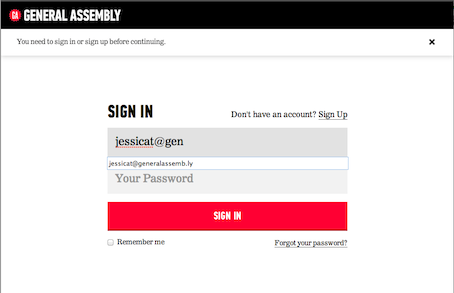
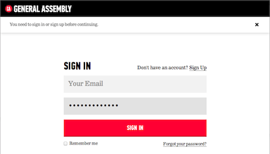
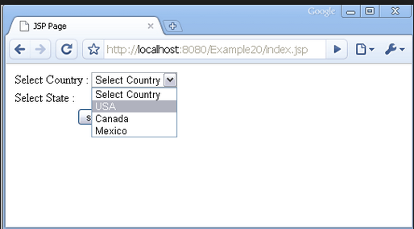
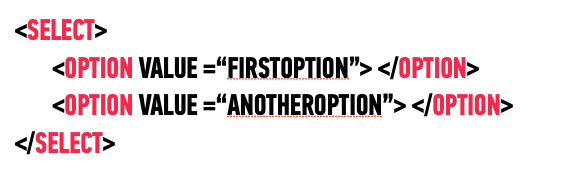

# FEWD LESSON 15

## FEWD - Forms & Inputs

### Instructors
Kit Yuen & Mart van de Ven


## Agenda
<aside class="notes"></aside>

* Forms
* Inputs
* Building an application form


## Forms
<aside class="notes">Mart ~ 20 Min</aside>

How we can get data from users.


## Forms
<aside class="notes"></aside>

*	Wrapper for data collection elements

	*	Text fields
	*	dropdowns
	*	Radio Buttons
	*	etc


## Forms
<aside class="notes"></aside>

Tells the page:

*	Where to send the data
*	How to send it
*	What is being sent


## Form Tag
<aside class="notes"></aside>


Available Attributes

*	Method (POST, GET, PUT, DELETE)
*	Action (Url to send data to)
*	Enctype (Multipart/form-data if uploading files)


## Form Tag
<aside class="notes"></aside>

In Action

```
<form action="register.php" method="post" enctype="multipart/form-data">
	<!--Data collection elements go here-->
</form>
```


## Inputs
<aside class="notes"> Kit ~ 20 Min

*	Gotchas
	*	The font-family for an input is not inherited!!!
	*	This can lead to funny sizing issues on Macs vs. PCs where the default font is not the same

</aside>

*	Place between ```<form> </form>``` tags

*	Attributes
	*	Type (Text,submit,password,email,checkbox,button,radio,file,etc)
	*	Name (Used server side)
	*	Placeholder
	*	Value

[Complete Spec](http://www.w3schools.com/tags/tag_input.asp)


## Text
<aside class="notes"></aside>

Use value to set initial text


## Email
<aside class="notes"></aside>

Allows browser to autofill field





## Password
<aside class="notes"></aside>

Hides characters as typed





## Submit vs File vs Button
<aside class="notes"></aside>

*	Value is button text. Defaults to submit in chrome, submit query in IE ```<input type="submit" value="Submit">```

*	Creates a file upload element ```<input type="file">```

*	Creates clickable button ```<input type="button">```


## Select and Option
<aside class="notes"></aside>




## Select and Option
<aside class="notes"></aside>



[HTML &lt;select&gt; Tag](http://www.w3schools.com/tags/tag_select.asp)


## Labels
<aside class="notes">
Usability
Clicking the label text in either case places the focus in the input field (great for radio buttons)
</aside>

Information about the input field should be put in a ```<label>``` tag

To tie the two together choose one of these methods:

```<label>Name <input type="text" name="yourName"></label>```

<br>

A label that is associated with a control via __for__ will be clickable too

```<label for="yourName">Name</label><input type="text" name="yourName" id="yourName">```

[HTML &lt;label&gt; Tag](http://www.w3schools.com/tags/tag_label.asp)


## Styling
<aside class="notes">Mart ~ 15 Min</aside>

*	Can’t be styled directly
	*	Checkboxes, File upload inputs, Radio buttons

*	Number of ways to do this *instructor can cover all or just choose one
	1.	Opacity 0 on the element, set it’s height and width to define clickable area, set the height and width of it’s parent to be the same as the input (don’t forget position relative). Style the parent.
	2.	Hide the element, style a corresponding label how you wanted the element to appear
	3.	Try using pseudo elements and the selector :checked for no JS switching between checked and unchecked images used for styling


## GA Application Form
<aside class="notes">Both ~ 90 Min</aside>

[HTML &lt;optgroup&gt; Tag](http://www.w3schools.com/tags/tag_optgroup.asp)

[HTML &lt;textarea&gt; Tag](http://www.w3schools.com/tags/tag_textarea.asp)


## Optional: Fieldset/Legend
<aside class="notes">Kit ~ 10 Min</aside>

`<fieldset>`
Wrapper for grouped form elements
Ex: First, middle, last name text fields

`<legend>`
Goes inside fieldset
Defines the grouping term for the fieldset

```
<fieldset>
	<legend>Your Name</legend>
	<input type="text" name="first_name">
	<input type="text" name="middle_name">
	<input type="text" name="last_name">
</fieldset>
```


## Optional: GET Requests
<aside class="notes">Mart ~ 5 Min</aside>

* GET request encodes data as part of URL
* POST encodes data as part of the payload


## Optional: Validation
<aside class="notes">Mart ~ 10 Min</aside>

* [Simple validation](http://www.the-art-of-web.com/html/html5-form-validation/) is provided by HTML5
*	Use simple if/else statements
*	or a validation library like [Parsley.js](http://parsleyjs.org/doc/index.html)