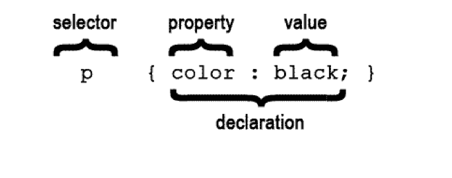

# FEWD LESSON 2

## FEWD - CSS Basics

### Instructors
Kit Yuen & Mart van de Ven 


## Agenda

* Manage your Git Repo
* HTML Basics Review
* Images
* Intro To CSS
  * Link Tag
  * Colors
  * Fonts
* Linking To Other Pages
* Lab Time


## Manage your Git Repo
<aside class="notes">Mart ~ 15 Min</aside>

### Let's do everything on Sublime Text

Create a new project in sublime text with your local repository as project root


## Commit your code
<aside class="notes">Mart ~ 35 Min</aside>

Commit your changes and push it to your forked repository

1. Make some changes or create a new file in your local repo

1. Add your changes so they are staged
  * Shift + Cmd + P and select **Git: Add...**
  * You can add all changes or any single file

1. Commit your change locally
  * Shift + Cmd + P and select **Git: Commit**
  * Enter your commit message a the newly opened tab
  * Close the tab to complete your commit

1. Push to your forked repo on GitHub
  * Shift + Cmd + P and select **Git: Push**


## Setup the **upstream**
<aside class="notes"></aside>

Keep your forked repository up to date.

1. Shift + Cmd + P and select **Git: Custom Command**

1. Add ga-students/FEWD_HK_4 as your `upstream` repo
```
git remote add upstream https://github.com/ga-students/FEWD_HK_4.git
```


## **Merge** latest changes from **upstream**
<aside class="notes"></aside>

**Merge** latest changes from [ga-students/FEWD_HK_4](https://github.com/ga-students/FEWD_HK_4) to your personal, forked repository.

1. Invoke **Git: Custom Command** and enter the following line
```
git merge upstream/gh-pages
```
1. Invoke the **Git: Push**


## What Tag Is It?
<aside class="notes">Kit ~ Cover topics missed in first class ~ 20 Min</aside>


## HTML Basics Review
<aside class="notes">Mart ~ 20 Min</aside>

### Images

* Images are placed using the `````` tag.

``````

<br>

* The `img` tag requires a `src` attribute, which tells the browser where to find the image to be placed.


## HTML Basics Review
<aside class="notes"></aside>

### How would you write the src in RELATIVE PATH?

```
[project]
  | - [images]
  |    | - logo.png
  |    | - apple.png
  |
  | - [fruits]
  |    | - apple.html
  |    
  | - index.html
```

* index.html - ``````
* apple.html - ``````

<br>

```..``` means **GO UP A DIRECTORY**. We could have ```../../``` too!


## HTML Basics Review
<aside class="notes"></aside>

### How would you write the src in RELATIVE PATH?

``````

Are the same as

``````

<br>

* ```..``` means **GO UP A DIRECTORY**
* ```.``` means **CURRENT DIRECTORY**


## HTML Basics Review
<aside class="notes"></aside>

### How would you write the src in ABSOLUTE PATH?

```
[project]
  | - [images]
  |    | - logo.png
  |    | - apple.png
  |
  | - [fruits]
  |    | - apple.html
  |    
  | - index.html
```

* index.html - ``````
* apple.html - ``````

<br>

ABSOLUTE PATH always starts from ```/```


## HTML Basics Review
<aside class="notes"></aside>

### Or Use a Full URL so you can even use an image from another website

``````


## HTML Basics Review
<aside class="notes"></aside>

## alt attribute

``````

* Add a simple description about your image as **alt** text
* A lingustic context for search engine to understand what's your image is about


## HTML Basics Review
<aside class="notes"></aside>

### 3 types of image format

* .png
* .gif
* .jpg/jpeg


## Let's do some exercises!
<aside class="notes">Mart : Concept, Kit : Code ~ 60 Min</aside>


## About Me

* We will create a About Me page from sketch
* Show you how to apply CSS on your HTML tags


## CSS
<aside class="notes"></aside>




## CSS
<aside class="notes"></aside>

### Where does CSS go?

* Inline CSS - Written on the style attribute on the HTML tag  
* Internal CSS - Written on the `<head>` tag
* External CSS - Written on a separate .css file


## CSS
<aside class="notes"></aside>

### Inline CSS

```
<p style="color: red;">Hello World</p>
```


## CSS
<aside class="notes"></aside>

### Internal CSS

```
<html>
  <head>
     <style type="text/css">
       p { color: red; }
     </style>
  </head>
  <body>
    <p>Hello World</p>
  </body>
</html>
```


## CSS
<aside class="notes"></aside>

### External CSS

```
<html>
  <head>
     <link rel="stylesheet" type="text/css" href="css/style.css">
  </head>
  <body>
    <p>Hello World</p>
  </body>
</html>
```


## CSS
<aside class="notes"></aside>

### Use EXTERNAL CSS for best practise!


## CSS Break Down
<aside class="notes"></aside>

```
p {
  color: red;
  font-weight: bold;
}
```

* This whole thing is called a **rule**.
* The `p` is called a **selector**, and it's followed by a set of **declarations** in a **declaration block**.


## CSS Break Down
<aside class="notes"></aside>

The **declaration block** here is:

```
{
  color: red;
  font-weight: bold;
}
```

**Declarations** go inside curly braces.


## CSS Break Down
<aside class="notes"></aside>

This example has two declarations. Here's the first:

```
color: red;
```

Every declaration is a **property** followed by a **value**, separated by a colon, ending in a semicolon.

In this declaration, we are setting the `color` **property** to the **value** `red`.


## CSS Break Down
<aside class="notes"></aside>

Let's look at the second declaration:

```
font-weight: bold;
```


## CSS Break Down
<aside class="notes"></aside>

As mentioned before, EXTERNAL CSS is a good practise.

But why do we want to link to a separate CSS file?


## Colors in CSS
<aside class="notes"></aside>

Colors can be specified in CSS in a variety of ways:


## Colors in CSS
<aside class="notes"></aside>

* keyword
* hex codes
* rgb
* hsl
* rgba
* hsla


## Colors in CSS
<aside class="notes"></aside>

### Keyword

These are used less frequently, but are handy for basic colors like `black` and `white`. There are several

[Check it out!](http://msdn.microsoft.com/en-us/library/ie/aa358802.aspx)


## Colors in CSS
<aside class="notes"></aside>

### Hex Codes (RGB)


[HTML Color Codes](http://html-color-codes.info/)


## Colors in CSS
<aside class="notes"></aside>

### RGB Color Values

```rgb(0,0,0)```

* The first value is red, the second green, the third blue.
* Each value can range from 0 to 255, which expresses the same number of color steps as 00 to FF in base-16.
* In RGB, `rgb(0,0,0)` is black, `rgb(255,255,255)` is white, `rgb(255,0,0)` is red, etc.


## Colors in CSS
<aside class="notes"></aside>

### RGBa Colors

* RGBa works identically to RGB, expect that it takes a 4th value called the "alpha".
* This is a value between 0 and 1 which will be used to determine a color's opacity on the page.


## Colors in CSS
<aside class="notes"></aside>

### HSL Colors
Similar notation to RGB values, but specify colors using hue, saturation, and lightness.

<br>

### HSLa Colors
As with RGBa, HSLa is exactly like HSL for the first 3 values, but takes a 4th alpha-channel value.

[HSL Color Picker](http://www.workwithcolor.com/hsl-color-picker-01.htm)


##Lab Time
<aside class="notes">Both ~ 30 min</aside>


* Wendy G. Bites - Resume.