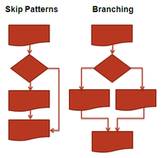
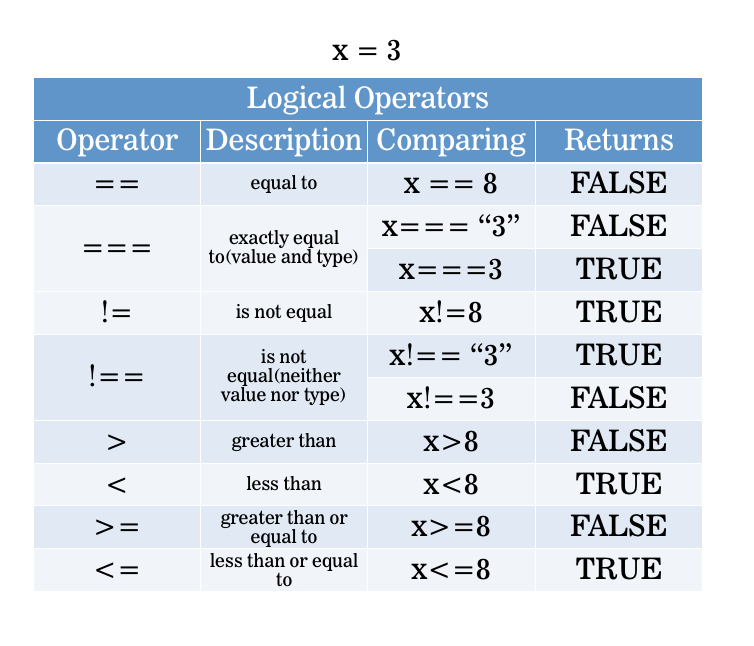
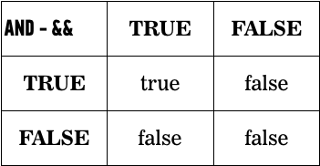

# FEWD LESSON 7

## FEWD - JS Basics

### Instructors
Kit Yuen & Mart van de Ven


## Agenda
<aside class="notes"></aside>

* Syntax
* Variables
* Arithmetic
* Conditionals


## Syntax
<aside class="notes">Mart ~ 5 Min</aside>

__Syntax:__ Spelling and grammar rules of a programming language.

It is the rule of writing!


## Syntax
<aside class="notes"></aside>

* Semicolon ;
* Parentheses ()
* Quotation Marks '' & ""

```
alert("Hello World");
```


## Separation of Concerns 
<aside class="notes">Mart ~ 5 Min</aside>


* [Codepen](http://codepen.io/nevan/pen/kBItz)


## What are variables?
<aside class="notes">Mart ~ 10 Min</aside>

What are variables?

* We can tell our program to remember values for us to use later on. 
* The action of saving a value to memory is called assignment
* The entity we use to store the value is called a variable
* The action of getting the value from a variable is called accessing the variable
* We will use all the above techniques to store values into variables, and generate new values using existing variables


## Variables Declaration
<aside class="notes"></aside>

Declaration:
```
var age;
```

Assignment:
```
age = 21;
```

Both at the same time:
```
var age = 21;
```


## Variable Re-Assignment
<aside class="notes"></aside>

```
// Initially
var name = "Jo";

// Re-Assignment
name = "Amir";
```


## Variable Conventions
<aside class="notes"></aside>

* Variables start with a lower case letter
* If they contain multiple words, subsequent words start with an upper case letter.

```
    var numberOfStudents = 10;
```


## What can you store in a variables?
<aside class="notes"></aside>


## Data Types
<aside class="notes"></aside>

* String (Text)
* Integer/Float (Number)
* Boolean (True or False)


## Score Keeper 
<aside class="notes">Kit ~ 15 Min</aside>


* [Codepen](http://codepen.io/nevan/pen/hAjtq)


## Strings
<aside class="notes">Kit ~ 30 Min</aside>

* Stores textual information
* Literal string is surrounded by quotes

<br>

```"How is the weather today?"```

```'Warm'```


## Strings
<aside class="notes"></aside>

Double vs single quoted strings:

<br>

```'They "purchased" it'```

```"It's a beautiful day"```


## Strings
<aside class="notes"></aside>

Escaping

<br>

```"They \"purchased\" it"```

```'It\'s a beautiful day'```


## Conversion: String To Number
<aside class="notes"></aside>

```
var intString = "4";
var intNumber = parseInt(intString, 10);
var floatString = "3.14159";
var floatNumber = parseFloat(floatString);
```


## Conversion: Number To String 
<aside class="notes"></aside>

```
var number = 4;
number.toString(); => "4"
```

__OR__
```
number + ""; => "4"
```


## Why would you need to convert datatypes?
<aside class="notes"></aside>

Try this in the Chrome console.

```
console.log(4 + 1);

console.log("4" + "1");
```


## Numbers
<aside class="notes"></aside>

Represent numerical data

```
int:        42
float:      3.14159265
```


## Numbers
<aside class="notes"></aside>

Signed

```
int:         +6
float:       -8.2
```

Can perform arithmetic on number data types


## Arithmetic In JavaScript
<aside class="notes">Mart ~ 25 Min</aside>


## Conditionals
<aside class="notes"></aside>




## Making Decisions
<aside class="notes"></aside>

It's either TRUE or FALSE (like booleans)

If you are greater than 18 
you are an adult

```
if (age > 18) {
  console.log("You are an adult")
}
```


## Comparisons - Equality
<aside class="notes"></aside>

Are two things equal?

```
10 === 10     // true
10 === 5      // false
"hi" === "hi" // true
```


## Logical Operators
<aside class="notes"></aside>


<aside class="notes"></aside>



## Conditional Syntax
<aside class="notes"></aside>

```
if (condition is true) { 
  // Do cool stuff
}
```


## Conditional Syntax
<aside class="notes"></aside>
```
if (condition is true) {
  // Do cool stuff
} else {
  // Do other cool stuff
} 
```


## Conditional Syntax
<aside class="notes"></aside>

```
var topic = "JS";
if (topic == "JS") {
  console.log("You're learning JavaScript");
} else if (topic == "JavaScript") {
  console.log("You're still learning JavaScript");
} else {
  console.log("You're learning something else");
}
```


## Multiple Conditions
<aside class="notes"></aside>

```
if (name == "GA" && password == "YellowPencil") {
  // Allow access to internet
}
```


## The Truth Table
<aside class="notes"></aside>




##The Truth Table
<aside class="notes"></aside>

```
if (day == "Monday" || day == "Wednesday") {
  // FEWD3 DAY
}
```


## Compare that
<aside class="notes">Kit ~ 25 Min</aside>


* [Codepen](http://codepen.io/nevan/pen/BkdqI)


## Temp Converter
<aside class="notes">Class ~ 45 Min</aside>


Add your JS file to HTML by the ```<script>``` tag inside ```<head>```

Example: 
&lt;script src="js/main.js"&gt;&lt;/script&gt;